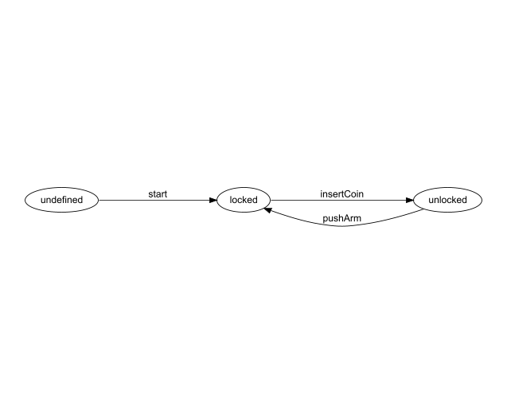

# About

## About this library

This library contains a [state machine](https://en.wikipedia.org/wiki/Finite-state_machine) definition and execution implementation for Kotlin.\
It provides various level of typing support depending on how it is used.

## Pending API enhancements

The API of this library would be slightly intuitive as soon as the following blocking Kotlin issues will be fixed:

- [KT-53551: Suspend functional type with context receiver causes ClassCastException](https://youtrack.jetbrains.com/issue/KT-53551/suspend-functional-type-with-context-receiver-causes-ClassCastException)
- [KT-51270: Support context receivers in multiplatform projects](https://youtrack.jetbrains.com/issue/KT-51270)

Please consider voting for these issues, so they may be fixed earlier...

## About state machines

A state machine is a computation model that can be used to represent and simulate sequential execution flow. 

A state machine contains states and defines the valid transitions from each state to others.\
Additionally it has an initial state where the execution starts and optionally terminal states where execution ends.

A classic state machine example is the ["coin-operated turnstile"](https://en.wikipedia.org/wiki/Finite-state_machine#Example:_coin-operated_turnstile):


> A turnstile, used to control access to subways and amusement park rides, is a gate with three rotating arms at waist height, one across the entryway. Initially the arms are locked, blocking the entry, preventing patrons from passing through. Depositing a coin or token in a slot on the turnstile unlocks the arms, allowing a single customer to push through. After the customer passes through, the arms are locked again until another coin is inserted.
> 
> Considered as a state machine, the turnstile has two possible states: Locked and Unlocked. There are two possible inputs that affect its state: putting a coin in the slot (coin) and pushing the arm (push).



## Why use state machines

By modeling execution flows and state changes in your code with state machines, your code will be more readable, more compact and easier to reason about.

# Usage and example

Let's model the execution flow of the above *turnstile state machine* using this library.

## Add Gradle dependency

The library artifacts are available in the [Maven Central](https://repo.maven.apache.org/maven2/) repository, so simply
add the [kotlinw-statemachine-core](https://search.maven.org/search?q=g:xyz.kotlinw%20a:kotlinw-statemachine-core) dependency to your `build.gradle.kts` file.

In a multiplatform project

```
kotlin {
    sourceSets {
        val commonMain by getting {
            dependencies {
                implementation("xyz.kotlinw:kotlinw-statemachine-core:0.4.0")
            }
        }
    }
}
```

In a platform-specific project:

```
dependencies {
    implementation("xyz.kotlinw:kotlinw-statemachine-core:0.4.0")
}
```

## Declare state machine class

Because this state machine does not have any additional data besides its current state, it should extend `SimpleStateMachineDefinition` for simplicity, and it can even be an `object`:

```
object TurnstileStateMachineDefinition: SimpleStateMachineDefinition<TurnstileStateMachineDefinition>() {
}
```

## Define states

Declare a property for each *state* by using `state()`:

```
val locked by state()

val unlocked by state()
```

## Define transitions

Declare a property named `start` for the initial transition:

```
override val start by initialTransitionTo(locked)
```

Declare one property for each valid transition:

```
val insertCoin by transitionTo(unlocked).from(locked)

val pushArm by transitionTo(locked).from(unlocked)
```

(The `transitionTo()` function call is optional but slightly increases readability.)

The final state machine definition class is (without  `transitionTo()` calls):

```
object TurnstileStateMachineDefinition: SimpleStateMachineDefinition<TurnstileStateMachineDefinition>() {

    val locked by state()

    val unlocked by state()

    override val start by initialTransitionTo(locked)

    val insertCoin by unlocked.from(locked)

    val pushArm by locked.from(unlocked)
}
```

## Generate DOT representation

State transitions form a graph that can be visualized by [Graphviz](https://graphviz.org/).

To export the [DOT](https://graphviz.org/doc/info/lang.html) representation of the state machine's state transition graph to the clipboard, run the following code:

```
fun main() {
    TurnstileStateMachineDefinition.exportDotToClipboard()
}
```

The generated image is:


## Configure

There are several options to execute some code

- when a transition happens, or
- while a state is active. 

Because these actions may be different for each state machine instance, they must be specified in a separate step by calling `configure()`.\
Configuration is trivial if no code is to be assigned to the various states or state changes, only a `CoroutineScope` should be passed to it (this is necessary because of [KT-51270](https://youtrack.jetbrains.com/issue/KT-51270)):

```
val configuredStateMachine = TurnstileStateMachineDefinition.configure()
```

At this point the state machine is not active yet, so this is a good place to add state change listeners:

```
launch(start = CoroutineStart.UNDISPATCHED) {
    configuredStateMachine.stateFlow.collect { println("New state: ${it.definition.name}") }
}
```

## Execute

A configured state machine can be executed by calling `execute()`, defining the initial transition:

```
val executor = configuredStateMachine.execute { smd.start() }
```

`executor` can be used to dispatch transition events to the state machine:

```
executor.dispatch { smd.insertCoin() }
executor.dispatch { smd.pushArm() }
```

Invalid transitions are sometimes detected at compile-time but often only during runtime:

```
// This would throw an IllegalStateException with message: "No valid transition exists from current state 'locked' to state 'locked'."
executor.dispatch { smd.pushArm() }
```

(The explicit `smd` reference will not be needed as soon as [KT-53551](https://youtrack.jetbrains.com/issue/KT-53551/suspend-functional-type-with-context-receiver-causes-ClassCastException) and [KT-51270](https://youtrack.jetbrains.com/issue/KT-51270) will be fixed.)

## More complex use-cases

For more complex use-cases and other supported functions, see the documentation.
