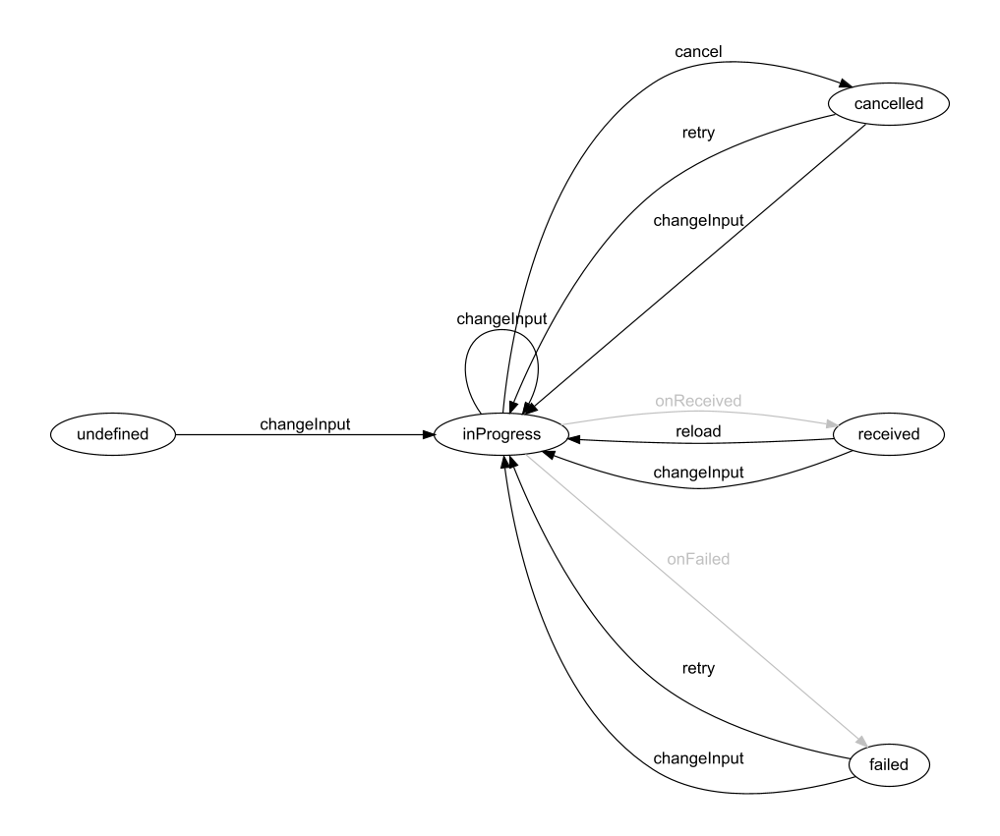

# About

# About this library

This library contains a type-safe [state machine](https://en.wikipedia.org/wiki/Finite-state_machine) implementation for Kotlin.

# About state machines

A state machine is a computation model that can be used to represent and simulate sequential execution flow. 

A state machine contains states and defines the valid transitions from each state to others.\
Additionally it has an initial state where the execution starts and optionally terminal states where execution ends.

An example state machine for fetching data:



# Why

By modeling execution flows in your code with state machines your code will be more readable, more compact and easier to follow :)

# Usage and example

Let's create a state machine to model the execution flow of the above "data-fetch" state-machine.

## Add Gradle dependency

The library artifacts are available in the [Maven Central](https://repo.maven.apache.org/maven2/) repository, so simply
add the [kotlinw-statemachine-core](https://search.maven.org/search?q=g:xyz.kotlinw%20a:kotlinw-statemachine-core) dependency to your `build.gradle.kts` file.

In a multiplatform project

```
kotlin {
    ...
    sourceSets {
        val commonMain by getting {
            dependencies {
                implementation("xyz.kotlinw:kotlinw-statemachine-core:0.4.0")

```

In a platform-specific project:

```
dependencies {
    implementation("xyz.kotlinw:kotlinw-statemachine-core:0.4.0")
```

Note that if you have a custom [`repositories { ... }`](https://docs.gradle.org/current/dsl/org.gradle.api.Project.html#org.gradle.api.Project:repositories(groovy.lang.Closure)) block in your build file then the [mavenCentral()](https://docs.gradle.org/current/dsl/org.gradle.api.artifacts.dsl.RepositoryHandler.html#org.gradle.api.artifacts.dsl.RepositoryHandler:mavenCentral()) repository should be added explicitly:

```
buildscript {
    repositories {
        mavenCentral()
        ...
    }
}
```

### Declare state data types

Most non-trivial state machines have some data associated with each state.\
In case of the data-fetch state machine there are 4 cases:

```
/**
 * Represents the status of fetching data of type [DataType] from a source specified by [InputType].
 *
 * @param InputType defines the source of the data (eg. an URL, a filter definition, etc.)
 * @param DataType type of the data to fetch
 * @param ErrorType describes an error occurred during fetching the data
 */
sealed interface DataFetchStatus<InputType, DataType, ErrorType> {

    val input: InputType

    /**
     * Data fetching is in progress.
     */
    data class InProgress<InputType, DataType, ErrorType>(
        override val input: InputType,
    ) : DataFetchStatus<InputType, DataType, ErrorType>

    /**
     * Data has been received.
     */
    data class Received<InputType, DataType, ErrorType>(
        override val input: InputType,
        val data: DataType
    ) : DataFetchStatus<InputType, DataType, ErrorType>

    /**
     * Data fetch has been cancelled.
     */
    data class Cancelled<InputType, DataType, ErrorType>(
        override val input: InputType
    ) : DataFetchStatus<InputType, DataType, ErrorType>

    /**
     * Data fetch has failed.
     */
    data class Failed<InputType, DataType, ErrorType>(
        override val input: InputType,
        val error: ErrorType
    ) : DataFetchStatus<InputType, DataType, ErrorType>
}
```

## Declare state machine class

Create a class for the state machine definition:

```

```

### Define states

### Define transitions

## Generate image representation

## Configure actions

## Execute

## Use in Compose
