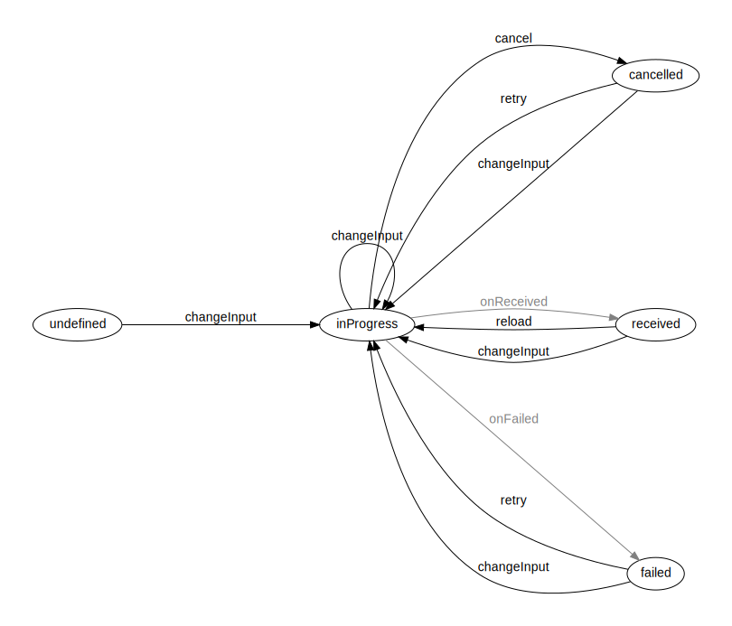

# About

## About this library

This library contains a [state machine](https://en.wikipedia.org/wiki/Finite-state_machine) definition and execution implementation for Kotlin. It provides various level of typing support depending on how it is used.

## About state machines

A state machine is a computation model that can be used to represent and simulate sequential execution flow. 

A state machine contains states and defines the valid transitions from each state to others.\
Additionally it has an initial state where the execution starts and optionally terminal states where execution ends.

An example state machine for fetching data:



## Why use state machines

By modeling execution flows and state changes in your code with state machines, your code will be more readable, more compact and easier to follow :)

# Usage and example

Let's create a state machine to model the execution flow of the above "data fetch" state-machine.

## Add Gradle dependency

The library artifacts are available in the [Maven Central](https://repo.maven.apache.org/maven2/) repository, so simply
add the [kotlinw-statemachine-core](https://search.maven.org/search?q=g:xyz.kotlinw%20a:kotlinw-statemachine-core) dependency to your `build.gradle.kts` file.

In a multiplatform project

```
kotlin {
    sourceSets {
        val commonMain by getting {
            dependencies {
                implementation("xyz.kotlinw:kotlinw-statemachine-core:0.4.0")
```

In a platform-specific project:

```
dependencies {
    implementation("xyz.kotlinw:kotlinw-statemachine-core:0.4.0")
```

Note that if you have a custom [`repositories { ... }`](https://docs.gradle.org/current/dsl/org.gradle.api.Project.html#org.gradle.api.Project:repositories(groovy.lang.Closure)) block in your build file then the [mavenCentral()](https://docs.gradle.org/current/dsl/org.gradle.api.artifacts.dsl.RepositoryHandler.html#org.gradle.api.artifacts.dsl.RepositoryHandler:mavenCentral()) repository should be added explicitly:

```
buildscript {
    repositories {
        mavenCentral()
        ...
    }
}
```

### Declare classes for holding state data

Most non-trivial state machines have some data associated with each state.\
For better typing support each state should have a dedicated class to hold its data.

In case of the "data fetch" state machine there are 4 states (not counting *undefined*), so we define 4 data classes:

```
/**
 * Represents the status of fetching data of type [DataType] from a source specified by [InputType].
 *
 * @param InputType defines the source of the data (eg. an URL, a filter definition, etc.)
 * @param DataType type of the data to fetch
 * @param ErrorType describes an error occurred during fetching the data
 */
sealed interface DataFetchStatus<InputType, DataType, ErrorType> {

    val input: InputType

    /**
     * Data fetching is in progress.
     */
    data class InProgress<InputType, DataType, ErrorType>(
        override val input: InputType,
    ) : DataFetchStatus<InputType, DataType, ErrorType>

    /**
     * Data has been received.
     */
    data class Received<InputType, DataType, ErrorType>(
        override val input: InputType,
        val data: DataType
    ) : DataFetchStatus<InputType, DataType, ErrorType>

    /**
     * Data fetch has been cancelled.
     */
    data class Cancelled<InputType, DataType, ErrorType>(
        override val input: InputType
    ) : DataFetchStatus<InputType, DataType, ErrorType>

    /**
     * Data fetch has failed.
     */
    data class Failed<InputType, DataType, ErrorType>(
        override val input: InputType,
        val error: ErrorType
    ) : DataFetchStatus<InputType, DataType, ErrorType>
}
```

## Declare state machine class

The state machine definition class should extend `StateMachineDefinition`:

```
class DataFetchStateMachineDefinition<InputType, DataType, ErrorType> :
    StateMachineDefinition<DataFetchStatus<InputType, DataType, ErrorType>, DataFetchStateMachineDefinition<InputType, DataType, ErrorType>>() {
}
```

### Define states

Declare a property for each state by using `state()`:

```
    val inProgress by state<DataFetchStatus.InProgress<InputType, DataType, ErrorType>>()

    val received by state<DataFetchStatus.Received<InputType, DataType, ErrorType>>()

    val cancelled by state<DataFetchStatus.Cancelled<InputType, DataType, ErrorType>>()

    val failed by state<DataFetchStatus.Failed<InputType, DataType, ErrorType>>()
```

### Define transitions

Declare a property named `start` for the initial transition:

```
    override val start by initialTransitionTo(inProgress) {
        DataFetchStatus.InProgress(it.transitionParameter)
    }
```

Declare a property for valid transitions:

```
    val cancel by cancelled.transitionFrom<Unit, _, _>(inProgress) {
        DataFetchStatus.Cancelled(it.fromStateData.input)
    }

    internal val onReceived by received.transitionFrom(inProgress) {
        DataFetchStatus.Received(it.fromStateData.input, it.transitionParameter)
    }

    internal val onFailed by failed.transitionFrom(inProgress) {
        DataFetchStatus.Failed(it.fromStateData.input, it.transitionParameter)
    }

    val reload by inProgress.transitionFrom<Unit, _, _>(received) {
        DataFetchStatus.InProgress(it.fromStateData.input)
    }

    val retry by inProgress.transitionFrom<Unit, _, _>(cancelled, failed) {
        DataFetchStatus.InProgress(it.fromStateData.input)
    }

    val changeInput by inProgress.transitionFrom(inProgress, received, failed, cancelled) {
        DataFetchStatus.InProgress(it.transitionParameter)
    }
```

## The final state machine definition class:

```
class DataFetchStateMachineDefinition<InputType, DataType, ErrorType> :
    StateMachineDefinition<DataFetchStatus<InputType, DataType, ErrorType>, DataFetchStateMachineDefinition<InputType, DataType, ErrorType>>() {

    val inProgress by state<DataFetchStatus.InProgress<InputType, DataType, ErrorType>>()

    val received by state<DataFetchStatus.Received<InputType, DataType, ErrorType>>()

    val cancelled by state<DataFetchStatus.Cancelled<InputType, DataType, ErrorType>>()

    val failed by state<DataFetchStatus.Failed<InputType, DataType, ErrorType>>()

    override val start by initialTransitionTo(inProgress) {
        DataFetchStatus.InProgress(it.transitionParameter)
    }

    val cancel by cancelled.transitionFrom<Unit, _, _>(inProgress) {
        DataFetchStatus.Cancelled(it.fromStateData.input)
    }

    internal val onReceived by received.transitionFrom(inProgress) {
        DataFetchStatus.Received(it.fromStateData.input, it.transitionParameter)
    }

    internal val onFailed by failed.transitionFrom(inProgress) {
        DataFetchStatus.Failed(it.fromStateData.input, it.transitionParameter)
    }

    val reload by inProgress.transitionFrom<Unit, _, _>(received) {
        DataFetchStatus.InProgress(it.fromStateData.input)
    }

    val retry by inProgress.transitionFrom<Unit, _, _>(cancelled, failed) {
        DataFetchStatus.InProgress(it.fromStateData.input)
    }

    val changeInput by inProgress.transitionFrom(inProgress, received, failed, cancelled) {
        DataFetchStatus.InProgress(it.transitionParameter)
    }
}
```

## Generate DOT representation

State transitions form a graph that can be easily visualized by [Graphviz](https://graphviz.org/).

To export the [DOT](https://graphviz.org/doc/info/lang.html) representation of the state machine's state transition graph to the clipboard, run the following code:

```
fun main() {
    DataFetchStateMachineDefinition<Nothing, Nothing, Nothing>().exportDotToClipboard()
}
```

## Configure actions

## Execute

## Use in Compose
